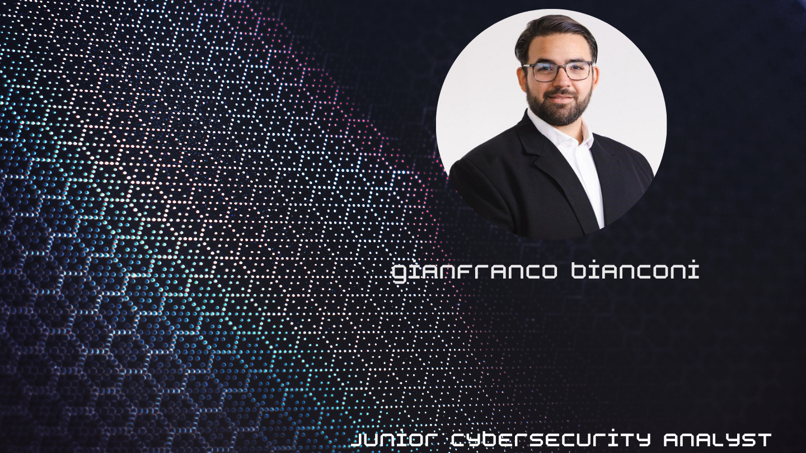

### Hi there 👋, Hi there ! Gianfranco Here !
#### enthusiastic Cybersecurity analyst
()
Dynamic professional with a solid foundation in Food & Beverage Management, now fully
committed to a career in technology following a successful transition into the IT sector. After a
significant event in late 2022, I redirected my focus and completed a comprehensive technology
boot camp with Masterschool, inspired by my brother's career in cybersecurity. My background
as a head chef has honed my problem-solving abilities, attention to detail, and leadership skills,
all of which are vital in the IT field. Fluent in five languages English, Spanish, Italian, German, and
Portuguese I bring a global perspective and excellent communication skills. I am now eager to
apply my passion for technology and newly acquired expertise in IT support, SOC analysis, or as
a Junior Cybersecurity Analyst, where I can contribute to safeguarding digital environments

Skills: Python | SQL | Active Directory | Snort | Wireshark | Splunk | Nessus | MITRE ATT&CK Framework | Sysinternals | Windows Event Logs | Metasploit | nmap | Kerberos | Windows 10/11 | Linux | NS | DHCP | ICMP | TCP/IP | Firewalls | VPN | Wi-Fi Standards | SMTP | SMB | SSL/TLS | IMAPS | network access control | identity and access managemen

- 🔭 I’m currently working on this page. 

